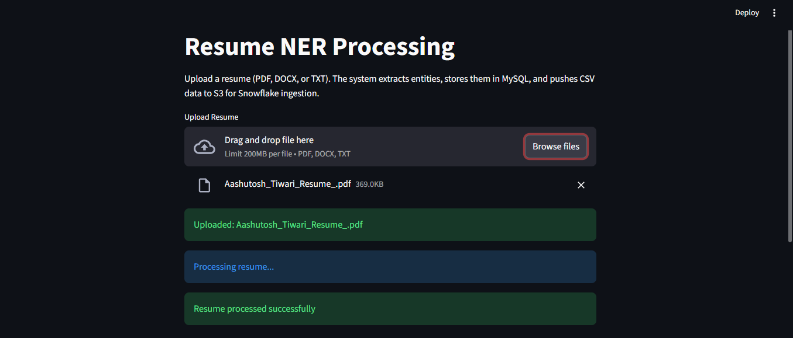
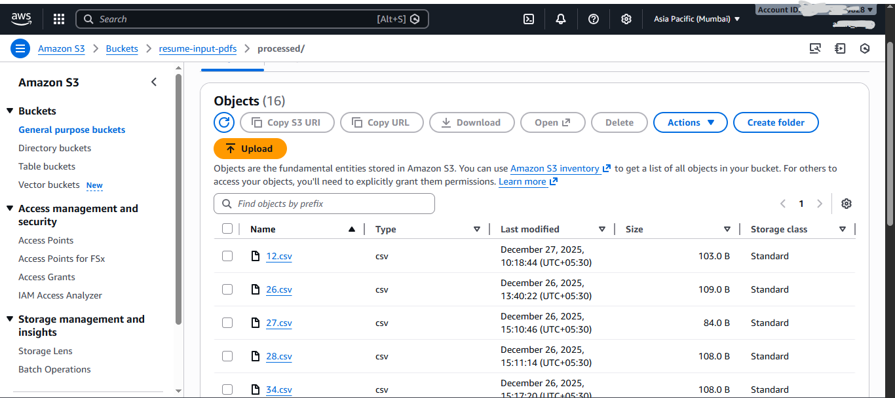
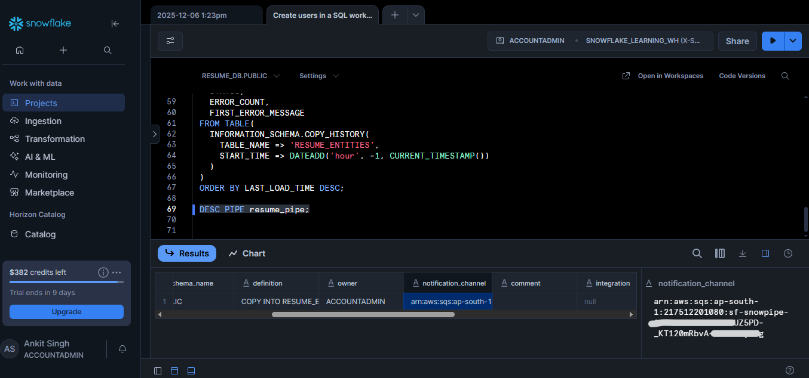
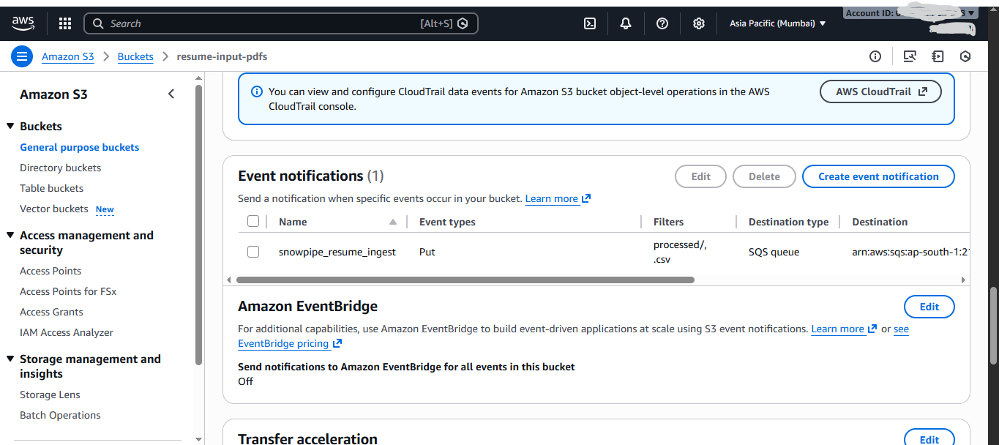
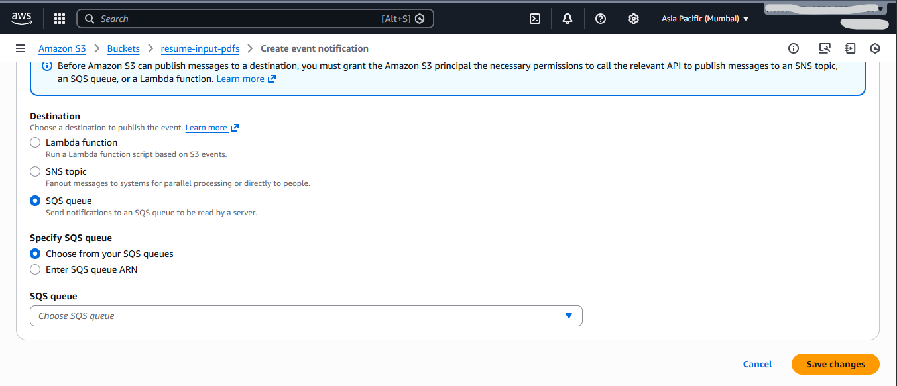

<h1 align="center">📄 Resume NER Data Pipeline (End-to-End)</h1>

An automated, production-style data engineering pipeline that extracts structured information from resumes and makes it analytics-ready.

<h2>📌 Overview</h2>

This project is an <b>end-to-end resume processing pipeline</b> that automatically extracts key information from resumes and makes it available for analytics and reporting.

  

It covers the complete data journey:

<b>Resume → NER → MySQL (workbench) → CSV → S3 → Snowflake → Power BI</b>

The system supports real-world resumes (<b>PDF, DOCX, TXT</b>), handles noisy formats, and follows <b>industry-grade data engineering practices</b>.

<h2>⚙️ What This Project Does</h2>
<ul>
  <li>User uploads a resume via a <b>Streamlit UI</b></li>
  <li>Text is extracted from PDF / DOCX / TXT files</li>
  <li><b>NER (Named Entity Recognition)</b> extracts:
    <ul>
      <li>Name</li>
      <li>Email</li>
      <li>Mobile Number</li>
      <li>Date of Birth</li>
      <li>Gender</li>
    </ul>
  </li>
  <li>Extracted data is inserted into <b>MySQL </b></li>
  <li>The inserted record is converted into a <b>CSV file</b></li>
  <li>CSV is uploaded to <b>Amazon S3</b></li>
  <li><b>Snowpipe</b> automatically ingests data into <b>Snowflake</b></li>
  <li><b>Power BI</b> connects to Snowflake for dashboards</li>
</ul>

<b>All steps are fully automated after resume upload.</b>

<h2>🧰 Tech Stack Used</h2>

<h3>Frontend</h3>
<ul>
  <li>Streamlit</li>
</ul>

<h3>Backend / Processing</h3>
<ul>
  <li>Python</li>
  <li>spaCy (NER)</li>
  <li>Regex</li>
  <li>pdfplumber</li>
  <li>python-docx</li>
</ul>

<h3>Databases</h3>
<ul>
  <li>MySQL (workbench)</li>
  <li>Snowflake</li>
</ul>

<h3>Cloud & Data Engineering</h3>
<ul>
  <li>Amazon S3</li>
  <li>Snowpipe (Auto ingestion)</li>
  <li>AWS SQS (Event notifications)</li>
</ul>

<h3>Analytics</h3>
<ul>
  <li>Power BI</li>
</ul>

<h2>📁 Project Structure</h2>

<pre>
resume_pipeline/
│__ screenshots
├── streamlit_app.py           # UI for resume upload
├── resume_ner_to_mysql.py     # Core pipeline logic
├── .env                       # Environment variables
├── .env.example               # Sample env file
├── requirements.txt           # Python dependencies
├── README.md                  # Project documentation
│
└── venv/                      # Virtual environment
</pre>

<h2>🔍 Extracted Fields</h2>
<ul>
  <li><b>Name</b> (handles ALL CAPS, initials, headers)</li>
  <li>Email</li>
  <li>Mobile Number</li>
  <li>
    Date of Birth  
     
    <small>
    Supports formats like:
    19/11/2004, 19 Nov 2004, Date of Birth: 01 Jan 2006
    </small>
  </li>
  <li>Gender</li>
</ul>

<h2>🗄️ MySQL Table Structure</h2>

<pre>
CREATE TABLE resume_entities (
    id INT AUTO_INCREMENT PRIMARY KEY,
    name VARCHAR(255),
    email VARCHAR(255) UNIQUE,
    mobile VARCHAR(50),
    dob VARCHAR(50),
    gender VARCHAR(20)
);
</pre>

<h2>❄️ Snowflake Table Structure</h2>

<pre>
CREATE TABLE RESUME_ENTITIES (
    ID INTEGER AUTOINCREMENT,
    NAME STRING,
    EMAIL STRING,
    MOBILE STRING,
    DOB STRING,
    GENDER STRING
);
</pre>

<h2>🚀 Snowflake Ingestion (Snowpipe)</h2>

<ul>
  <li>CSV files uploaded to:</li>
</ul>

<pre>
s3://resume-input-pdfs/processed/
</pre>

<ul>
  <li>Snowpipe listens for <code>.csv</code> files</li>
  <li>S3 event notifications trigger ingestion automatically</li>
  <li>No manual <code>COPY</code> commands required</li>
</ul>

<h2>🔐 Environment Variables (.env)</h2>

<pre>
# MySQL
MYSQL_HOST=your-rds-endpoint
MYSQL_USER=your-user
MYSQL_PASSWORD=your-password
MYSQL_DB=resume_db

# AWS
AWS_ACCESS_KEY_ID=xxxx
AWS_SECRET_ACCESS_KEY=xxxx
AWS_DEFAULT_REGION=ap-south-1
S3_BUCKET_NAME=resume-input-pdfs
</pre>

<h2>▶️ How to Run the Project</h2>

<h3>1️⃣ Create Virtual Environment</h3>
<pre>
python -m venv venv
source venv/bin/activate
# Windows: venv\Scripts\activate
</pre>

<h3>2️⃣ Install Dependencies</h3>
<pre>
pip install -r requirements.txt
python -m spacy download en_core_web_sm
</pre>

<h3>3️⃣ Run Streamlit App</h3>
<pre>
streamlit run streamlit_app.py
</pre>

<h3>4️⃣ Upload Resume</h3>
<ul>
  <li>Upload PDF / DOCX / TXT</li>
  <li>Pipeline runs automatically</li>
  <li>Data appears in:
    <ul>
      <li>MySQL</li>
      <li>Snowflake (via S3 + Snowpipe)</li>
      <li>Power BI dashboard (after refresh)</li>
    </ul>
  </li>
</ul>

<h2>🛡️ Error Handling & Edge Cases</h2>
<ul>
  <li>Scanned PDFs detected and rejected gracefully</li>
  <li>Duplicate resumes (same email) update existing records</li>
  <li>Safe MySQL cursor handling</li>
  <li>Snowpipe ignores old files automatically</li>
  <li>Clean separation of UI and backend logic</li>
</ul>

<h2>💡 Why This Project Is Valuable</h2>
<ul>
  <li>Demonstrates real-world data engineering workflows</li>
  <li>Covers ingestion, transformation, storage, and analytics</li>
  <li>Implements event-driven architecture</li>
  <li>Scalable and production-ready</li>
  <li>Reflects real HR / ATS resume processing systems</li>
</ul>

<h2>🧭 End-to-End Workflow (With Screenshots)</h2>

This section visually explains how a resume moves through the system — from upload to analytics —
using real screenshots, AWS configuration, and Snowflake SQL.

<h3>0️⃣ Resume Upload & NER Extraction</h3>

The user uploads a resume using the Streamlit UI.  
The backend extracts text and applies <b>spaCy + Regex</b> to identify structured entities.

  
   
  <i>Streamlit UI – Resume Upload & NER Output</i>

<h3>1️⃣ CSV Upload to Amazon S3</h3>

After successful extraction and insertion into MySQL, the record is converted into a CSV file
and uploaded to the S3 bucket:

<pre>
s3://resume-input-pdfs/processed/
</pre>

  
   
  <i>S3 Bucket – Processed CSV Files</i>

<pre>
import boto3

s3 = boto3.client("s3")

s3.upload_file(
    Filename="resume_data.csv",
    Bucket="resume-input-pdfs",
    Key="processed/resume_data.csv"
)
</pre>

<h3>2️⃣ Snowflake Pipe & Notification Channel</h3>

Snowpipe is configured to automatically ingest CSV files from S3.
The pipe is linked to an <b>Amazon SQS notification channel</b>.

  
   
  <i>Snowflake Notification Channel</i>

<pre>
CREATE OR REPLACE NOTIFICATION INTEGRATION resume_s3_notification
TYPE = QUEUE
NOTIFICATION_PROVIDER = AWS_SQS
ENABLED = TRUE
AWS_SQS_ARN = 'arn:aws:sqs:ap-south-1:xxxx:resume-sqs-queue';
</pre>
<pre>
DESC PIPE resume_pipe;
</pre>
<h3>3️⃣ Configure S3 Event Notifications</h3>

The S3 bucket is configured to notify Snowflake via SQS whenever
a new CSV file is uploaded to the <code>processed/</code> folder.

  
   
  <i>S3 Event Notification Configuration</i>

<h3>4️⃣ Attach SQS Queue to S3 Bucket</h3>

The S3 bucket sends event notifications to the SQS queue
used by Snowflake Snowpipe.

  
   
  <i>S3 → SQS Integration</i>

<pre>
Event type      : PUT
Prefix filter   : processed/
Destination     : SQS Queue
</pre>

<h3>5️⃣ Snowpipe Auto-Ingest into Snowflake</h3>

Once the CSV arrives in S3:

<ul>
  <li>S3 sends event to SQS</li>
  <li>Snowpipe detects the event</li>
  <li>CSV is automatically loaded into Snowflake</li>
</ul>

<b>No manual COPY commands are required.</b>

<pre>
CREATE OR REPLACE PIPE resume_pipe
AUTO_INGEST = TRUE
INTEGRATION = resume_s3_notification
AS
COPY INTO RESUME_ENTITIES
FROM @resume_stage
FILE_FORMAT = (TYPE = 'CSV' FIELD_OPTIONALLY_ENCLOSED_BY='"')
ON_ERROR = 'CONTINUE';
</pre>

<h3>6️⃣ Power BI Analytics</h3>

Power BI connects directly to Snowflake and visualizes the
ingested resume data for reporting and insights.

This completes the fully automated, event-driven data pipeline.

<pre>
Streamlit UI
   ↓
NER Extraction
   ↓
MySQL
   ↓
CSV
   ↓
S3 (processed/)
   ↓
SQS
   ↓
Snowpipe
   ↓
Snowflake
   ↓
Power BI
</pre>

